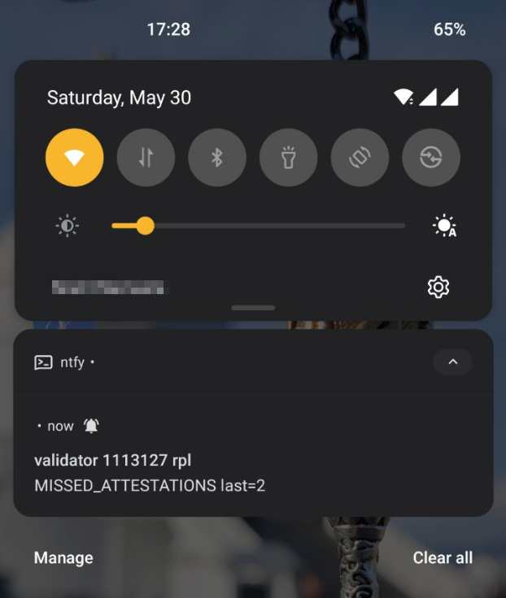
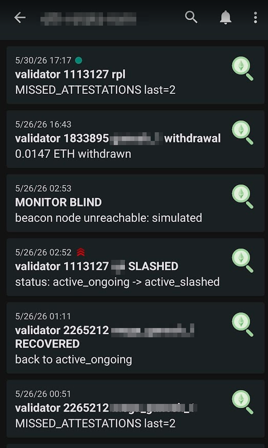
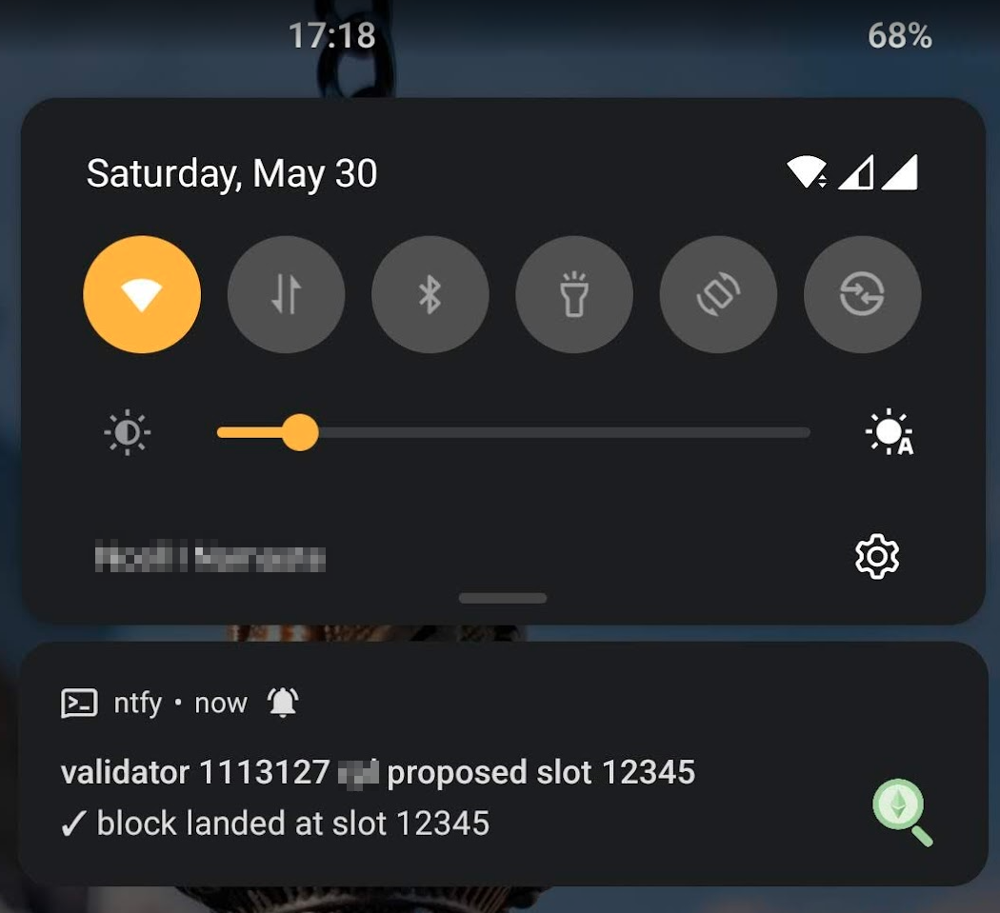

#  eth-validator-stats

[](https://github.com/Workharu/eth-validator-stats/actions/workflows/pre-release-check.yml)
[](https://pypi.org/project/eth-validator-stats/)
[](https://pypi.org/project/eth-validator-stats/)
[](LICENSE)
[](https://github.com/Workharu/eth-validator-stats/releases/latest)

Watch your Ethereum validators from a tiny self-hosted CLI. It talks to *your* beacon node (no third-party telemetry) and pushes alerts straight to your phone via [ntfy](https://ntfy.sh).

<table>
  <tr>
    <td></td>
    <td></td>
    <td></td>
  </tr>
  <tr>
    <td align="center"><sub>operational alert — missed attestations</sub></td>
    <td align="center"><sub>your push history in the ntfy app</sub></td>
    <td align="center"><sub>✓ proposed block (positive event)</sub></td>
  </tr>
</table>

## Install in 60 seconds

```bash
# Auto-detects .deb / .rpm / pipx and installs the right one (Linux & macOS).
curl -fsSL https://raw.githubusercontent.com/Workharu/eth-validator-stats/main/scripts/install.sh | sudo bash

# Interactive wizard: probes your beacon node, generates an ntfy topic, scans a QR for your phone.
sudo eth-validator-stats init

# Sanity-check the last snapshot
eth-validator-stats status
```

That's it. On `.deb` / `.rpm` installs, `init` also starts a `systemd` service that polls every 60 seconds.

> `evs` is a 3-character alias for `eth-validator-stats` — `evs status`, `evs check --missed 3`, etc.

## How notifications work

Your phone subscribes to a private [ntfy.sh](https://ntfy.sh) topic that only you know. The CLI POSTs to that topic; ntfy pushes to your phone. The `init` wizard generates a random topic name, prints a QR you scan with the ntfy mobile app ([iOS](https://apps.apple.com/us/app/ntfy/id1625396347) / [Android](https://play.google.com/store/apps/details?id=io.heckel.ntfy)), and you're done.

**Verify the pipe before you trust it:**

```bash
eth-validator-stats simulate slashed     # urgent push (bypasses Do-Not-Disturb)
eth-validator-stats simulate missed      # normal-priority push
```

You should see them on your phone within a second.

## What you get pushed

- **Health** — `OFFLINE`, `MISSED ATTESTATIONS`, `withdrawal`, `MONITOR BLIND` / `MONITOR RECOVERED`
- **Proposals** — `proposing soon`, `✓ proposed`, `✗ missed proposal`
- **Lifecycle** — `ACTIVATED`, **`SLASHED`** (urgent), `EXIT INITIATED`, `EXITED`, `WITHDRAWAL READY`
- **Liveness** — daily `MONITOR ALIVE` so silence means something. Want sub-5-minute detection? Set `alerts.heartbeat_url` to a free [healthchecks.io](https://healthchecks.io/) URL.

One push per event, deduplicated per-validator with a configurable cooldown. Full reference (thresholds, env vars, every flag) is in [`docs/USAGE.md`](docs/USAGE.md).

And a status table you can pull on-demand:

```
                         Validators
┏━━━━━━━━┳━━━━━━━━┳════════════════┳━━━━━━━━━━━━━━━┳━━━━━━━━━━━━━┓
┃    idx ┃ label  ┃ status         ┃ balance (ETH) ┃ last 5 atts ┃
┡━━━━━━━━╇━━━━━━━━╇════════════════╇━━━━━━━━━━━━━━━╇━━━━━━━━━━━━━┩
│ 123456 │ home-1 │ active_ongoing │       32.0182 │ ● ● ● ● ●   │
│ 234567 │ home-2 │ active_ongoing │       32.0177 │ ● · ● ● ●   │
└────────┴────────┴────────────────┴───────────────┴─────────────┘
```

`●` attested, `·` missed, `?` not yet observed.

## Commands

```bash
evs status                              # last snapshot (read-only; --refresh to poll first)
evs watch                               # loop forever (what the systemd service runs)
evs check --missed 3                    # one-shot for cron — exits 2 if any alert fires

evs validators add 12345 --label home-1
evs validators list --status
evs validators rm home-1

evs simulate <event>                    # test the push pipe end-to-end
evs info                                # probe your beacon node's API
```

## Configuration

`init` writes a `config.yml`. Edit it directly anytime — `validators add/list/rm` is a convenience for skipping YAML.

```yaml
beacon_node_url: http://localhost:3500
validators:
  - { index: 123456, label: home-1 }
  - { pubkey: "0xb1d2...", label: home-2 }
alerts:
  ntfy_topic: https://ntfy.sh/eth-vstats-9f8e7d6c5b4a
  cooldown_minutes: 30
  missed_attestations_threshold: 2
```

Full annotated example: [`config.yml.example`](config.yml.example). Lookup order: `$ETH_VALIDATOR_STATS_CONFIG` → `/etc/eth-validator-stats/config.yml` → `~/.config/eth-validator-stats/config.yml`. First match wins.

When you upgrade and the schema grows, the CLI appends new keys (commented out, with defaults) to your existing `config.yml` so you can see what's available. Drop `# config-sync: off` anywhere in the file to opt out.

## Install paths (manual)

The curl one-liner above covers most setups. Pick a path explicitly if you prefer:

<details>
<summary><b>Debian / Ubuntu — <code>.deb</code></b></summary>

Debian 12+ / Ubuntu 22.04+ (also 24.04). The `.deb` bundles its own Python — no PPAs.

```bash
# Latest .deb at https://github.com/Workharu/eth-validator-stats/releases/latest
sudo apt install -y ./eth-validator-stats_0.5.0-1_amd64.deb
sudo eth-validator-stats init --system
sudo systemctl status eth-validator-stats
```

Use `apt install ./path.deb` (not `dpkg -i`) so deps like `adduser` resolve. Files: `/opt/eth-validator-stats/`, symlinks in `/usr/bin/`, config + state at `/etc/eth-validator-stats/` and `/var/lib/eth-validator-stats/`. `apt remove` keeps user data; `apt purge` wipes everything.
</details>

<details>
<summary><b>Fedora / RHEL / Rocky / Alma 9+ — <code>.rpm</code></b></summary>

```bash
sudo dnf install ./eth-validator-stats-0.5.0-1.fc40.x86_64.rpm
sudo eth-validator-stats init --system
sudo systemctl status eth-validator-stats
```

Same paths and semantics as the `.deb`. `dnf remove` keeps config + state.
</details>

<details>
<summary><b>macOS / hosts without <code>.deb</code> or <code>.rpm</code> — <code>pipx</code></b></summary>

```bash
# Install pipx first if needed: apt|dnf install pipx, or `brew install pipx` on macOS.
pipx install eth-validator-stats
eth-validator-stats init        # per-user config at ~/.config/eth-validator-stats/
```

For systemd integration on Linux without the distro packages:

```bash
sudo eth-validator-stats install-service       # system-scope unit
eth-validator-stats install-service --user     # or per-user, no sudo
sudo eth-validator-stats init --system         # writes config + starts service
```

Upgrade: `pipx install --force eth-validator-stats`. Uninstall: `sudo eth-validator-stats uninstall-service --purge && pipx uninstall eth-validator-stats`.
</details>

<details>
<summary><b>From source (development)</b></summary>

```bash
git clone https://github.com/Workharu/eth-validator-stats
cd eth-validator-stats
uv sync
uv run eth-validator-stats status
uv run pytest -q
```

See [`packaging/linux/README.md`](packaging/linux/README.md) for running the source build as a systemd unit.
</details>

## More

- [`COMPATIBILITY.md`](COMPATIBILITY.md) — beacon clients tested (Prysm / Lighthouse / Teku / Nimbus / Lodestar)
- [`docs/USAGE.md`](docs/USAGE.md) — every flag, env var, and alert option in full
- [`CHANGELOG.md`](CHANGELOG.md) — releases
- [`SECURITY.md`](SECURITY.md) — report a vulnerability
- [`CONTRIBUTING.md`](CONTRIBUTING.md) — dev setup and PR workflow

## License

MIT — see [LICENSE](LICENSE).
